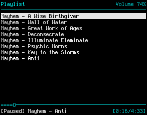

# MPD et ses clients

MPD, alias Music Player Daemon permet de gérer la lecture de musique en mode
daemon. Les avantages de la chose sont simples, la lecture de musique est en
fond, et tu peux faire ce que tu veux avec ta machine, ca continuera de jouer.
Tu peux fermer ton client MPD (mpc, ncmpc), tu peux crasher X si ca te chante,
ta musique continuera de tourner. Et comble du comble, si tu reboot en pleine
lecture, ta musique reprendra automatiquement là où tu t'es arrété.  

Autre avantage également, pour nous les geeks, c'est que grâce à son
fonctionnement client/serveur, tu peux hacker comme un petit fou. Ou si tu
n'aimes pas hackoder, tu peux faire plein de choses bien sympa avec le client
mpc.  

Alors oui, cette page est plus là pour le prosélitisme que pour vraiment
t'apporter quoi que ce soit, mais je vais quand même lâcher un ou deux trucs
dont toi seul pourra juger du niveau d'utilité.

## ncmpc

Un petit screenshot pour la route :

ncmpc est un client convi (tout est relatif) en CLI, assez pratique pour se
ballader dans sa bibliothèque. Pour les plus balayzes de la CLI, mpc fera
l'affaire.  
  
J'ai un peu tuné mon ncmpc, principalement les couleurs :

	romain@bleh ~ % cat .ncmpc/config
	auto-center = yes
	set-xterm-title = yes
	hide-cursor = 5
	xterm-title-format = "ncmpc"
	seek-time = 5
	enable-colors = yes
	color background = none
	color title = cyan
	color title-bold = brightcyan
	color line = cyan
	color line-flags = brightcyan
	color list = white
	color list-bold = brightwhite
	color progressbar = cyan
	color status-state = brightwhite
	color status-song  = white
	color status-time  = cyan
