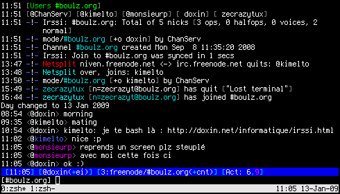

# irssi

Qu'est-ce ? *irssi* est un client
[IRC](http://fr.wikipedia.org/wiki/Internet<i>Relay<i>Chat) en mode console,
donc léger, donc super par ssh et tout. Pas grand chose à dire la dessus.  
  
Un petit screenshot pour voir de quoi ca a l'air :  

La barre blanche en bas, c'est [tmux](/informatique/tmux.html), car mon irssi
est sur mon serveur. (Et on voit que je me lève plus tôt que cette grosse
feignasse de kimelto.)

## plugins

_irssi_ a le bon gout de pouvoir être agrémenté de plugins tous plus cools les
uns que les autres. Mais comme ca sert à rien d'en mettre partout jusqu'à
saigner des yeux, on va en mettre le moins possible.  
  
Voici ceux que j'utilise :

- [nickcolor](http://scripts.irssi.org/scripts/nickcolor.pl) affiche une couleur
  différente par nick. Ca permet une lecture très aisée des conversations à plus
  de deux personnes.

Voilà, c'est tout, le reste me satisfait parfaitement. Mais vous pouvez toujours
aller faire un tour [ici](http://scripts.irssi.org) pour en grapiller d'autres.

## charger/décharger les plugins

Attention, section biberon.  
On place ses scripts dans _~/.irssi/scripts_, on tape _/script_load_nomduscript_
pour le charger ou _/script_unload_nomduscript_ pour le décharger. Dur non ?  
Petite subtilité, si on veut que notre script soit chargé automatiquement au
démarrage d'irssi, on créé un répertoire _autorun_ dans _~/.irssi/scripts_ et :

    $ ln -s notrescript.pl autorun/notrescript.pl

## configuration

Rien de bien sorcier ici, simplement, comme on a le plugin _nickcolor_, les
hilights ne resortent pas bien. On peut remédier à cà en hilightant la ligne
complète et pas seulement le nick du hilighter :

	/hilight -line doxin

On peut accesoirement changer la couleur, et tout, car c'est pas très très
beau dans l'état, mais bon :

	/help hilight

comme on dit chez moi.
